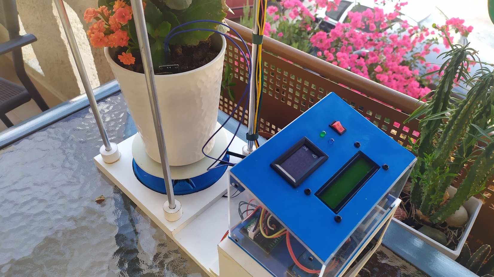
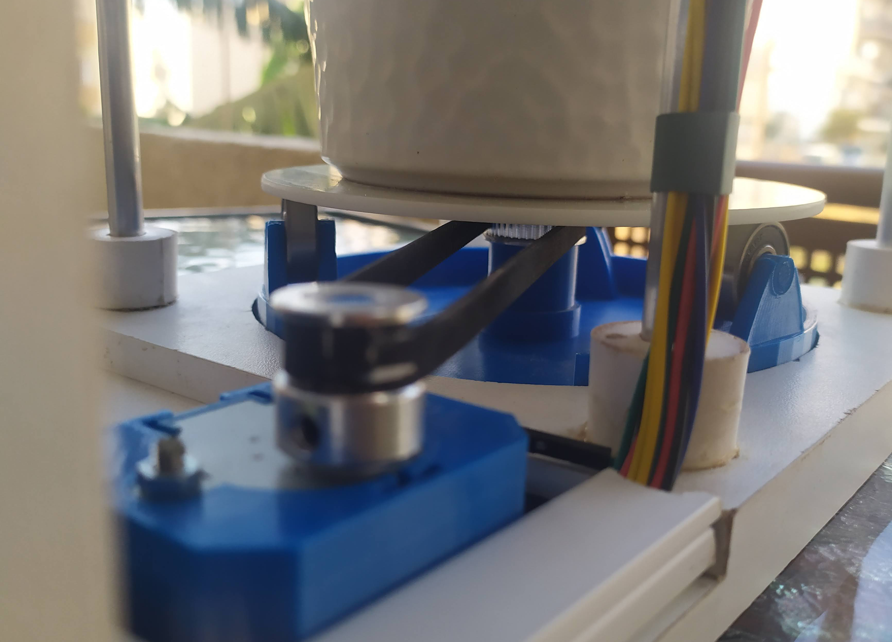
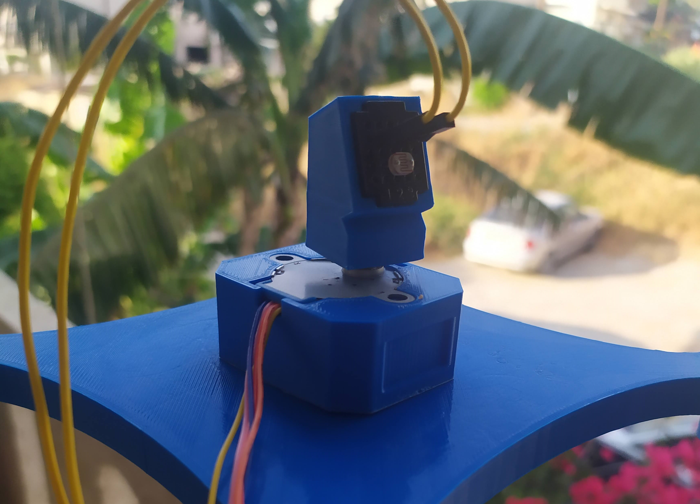
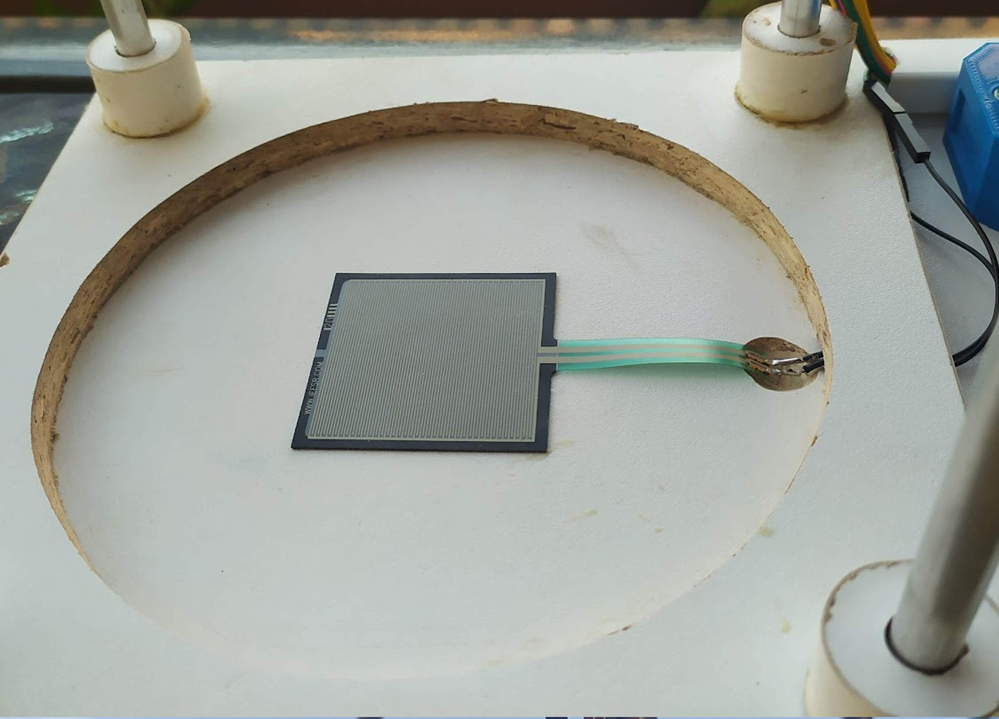
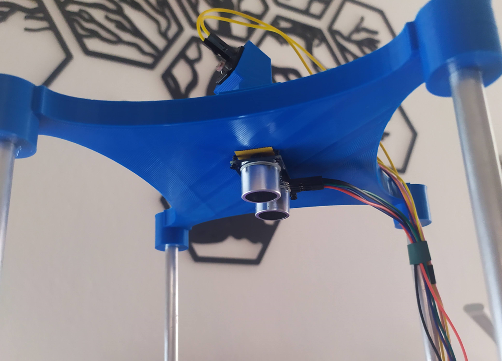
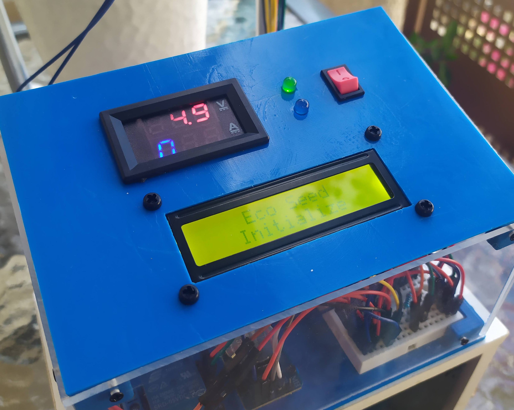
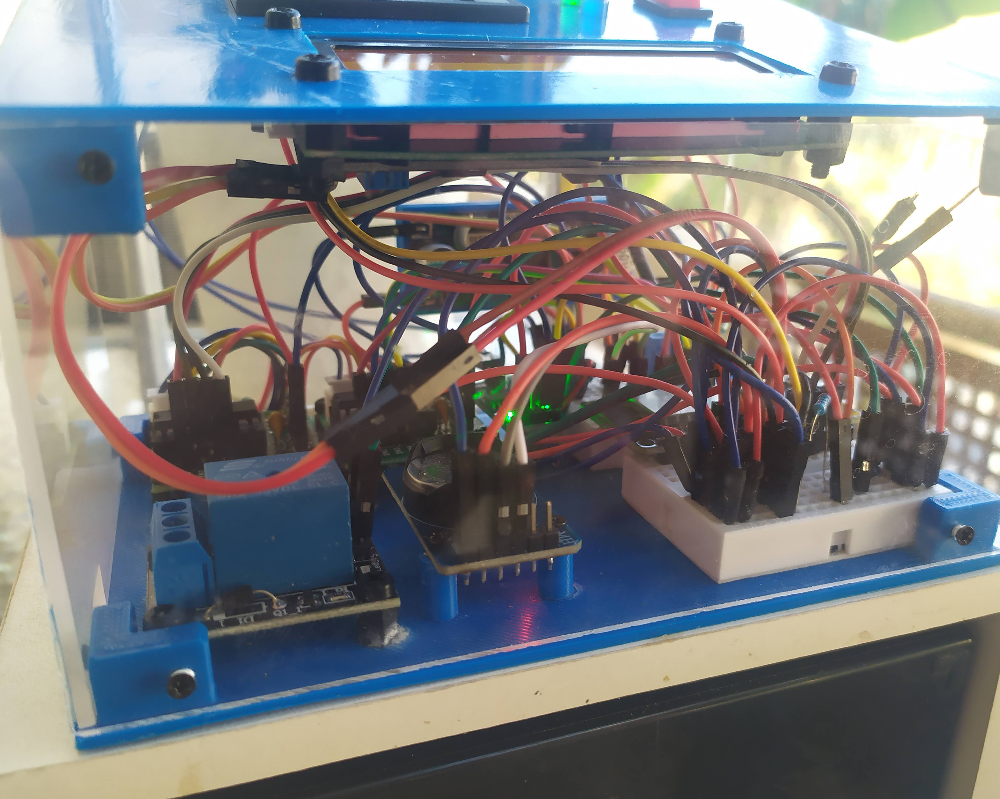
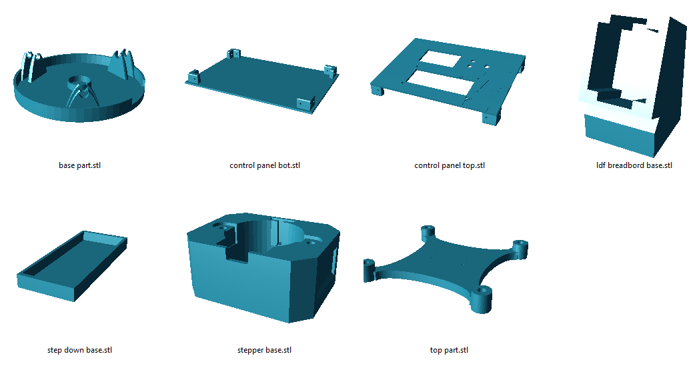
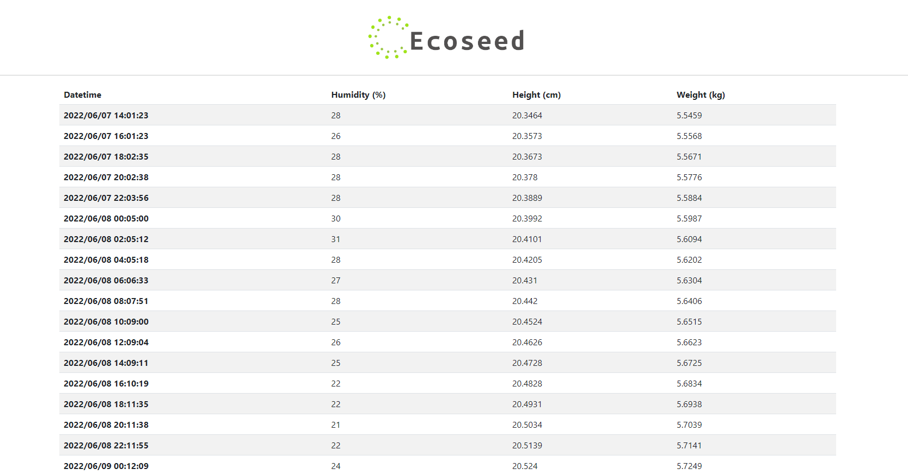

# EcoSeed
Every plant needs a someone to keep an eye on it. Or maybe something? 

# Abstract
**EcoSeed** is an eco friendly system that takes good care of your plant. The system consists of several sensors 
used to monitor specific factors of the growth rate of a plant, such as its weight and height. Moreover, EcoSeed is
able to take care of the plant, providing water whenever needed and turning the pot to the point where the amount
of sunlight is highest. Last but not least, our system collects all the measured values to a database, providing the
users with information for study and data mining. 

# Components
**Ecoseed** is a wooden-plastic making, mainly consisting of two parts:
#### The base
On one side, there is the base on which the flowerpot is placed. At the top of the base, you can find a stepper with an 
LDR sensor on it. This part continuously rotates to detect the best direction based of the maximum amount of sunlight. 
The base sits on three bearings which help it to rotatethe flowerpot easily. Next to the base there is another stepper 
motor, which rotates the flowerpot towards the direction detected.

Bottom part of the base             |  Top part of the base
:-------------------------:|:-------------------------:
  |  

Bellow the base, you will find a force sensor which is used to calculate the weight of the plant. Last, under the top
part of the base, there is an ultrasonic sensor which helps to calculate the height of the plant.

Force sensor             |  Ultrasonic sensor
:-------------------------:|:-------------------------:
  |  

#### The control panel
On the other side, there is the control panel, an enclosure made of plastic and plexiglas on top of a 12V battery. The 
control panel contains the rest of the electronic components of the system:
- <b>ESP32</b> (the micro-controller responsible for the functionality of the system)
- <b>Controllers</b> for the two steppers
- <b>Relay module</b> (used to control the water pump)
- <b>RTC module</b> (used to record the measured values every two hours)
- <b>Soil moisture</b> sensor controller
- <b>Step-down</b> module (to convert battery's 12V to 5V needed)
- <b>Voltmeter</b> (to check the circuit's voltage)
- <b>LCD display</b> (to monitor measured values in real time) 

Top view             |  Side view
:-------------------------:|:-------------------------:
  |  

All the plastic parts were printed with PLA on an Ender 3 pro 3D printer. All the models were custom made by our team.

# Functionality
Like every micro-controller, **EcoSeed** performs in a loop. Thus, it first initializes the necessary modules
and then repeatedly does the following actions:
- rotates the stepper motor with the LDF sensor to detect the best direction according to the sunlight
- rotates the flowerpot stepper motor if necessary
- measures the height, weight and moisture
- if the time is right, sends the measured data to the server database
- updates the LCD display with the measured data

At any time, the user can check the collected data in a page of our server.

# Future Work
During the development of **EcoSeed** various ideas came to our minds as improvements to our system. Since we
established a connection with a server, we could make our system a bit more clever. We could store more data in
our database and, according to the plant species in the pot, the system would provide the amount of water or any
other required ingredients, based on data stored in our database. Moreover, a camera could be attached to take
pictures of the plant several times during a day. We would be more than happy to hear your input on our system.